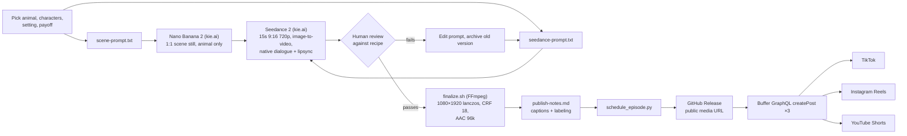

# AI Short-Video Pipeline ("Kissing Weird Animals")

A small, scriptable pipeline that produces 15-second vertical AI videos for TikTok, Instagram Reels and YouTube Shorts, then schedules them across all three through the Buffer API.

It was built to run a short-form channel called **Kissing Weird Animals**: each episode shows a different person trying to kiss a strange real-world animal (axolotl, tarantula, star-nosed mole, cane toad...), with a different payoff each time.

> **These videos are AI-generated.** Every frame and every voice comes from image and video models. Nobody in them is a real person, and no real animals were involved. Label them as AI-generated wherever a platform requires or offers it. The scheduler in this repo does that by default (see [AI-content labeling](#ai-content-labeling)).

## What's in the repo

| Path | What it is |
|---|---|
| `scripts/run-episode.sh` | The main runner: scene image, then video, then download |
| `scripts/finalize.sh` | FFmpeg upscale to 1080×1920 and an audio re-encode that platforms accept |
| `scripts/buffer/schedule_episode.py` | Hosts the file on GitHub Releases and queues TikTok / IG / YouTube posts through Buffer's GraphQL API |
| `scripts/buffer/discover_channels.py` | One-time helper that writes `channels.json` (see `channels.example.json`) |
| `scripts/regen-ref.sh`, `scripts/seedance-from-url.sh` | Re-roll only the image, or only the video, to save credits while iterating |
| `scripts/production-recipe.md` | The locked prompt templates and the "don't do this" list learned episode by episode |
| `scripts/aesthetic-spec.md` | Six-part visual spec (camera motion, background, lighting, lens, composition, texture) that drives prompt wording |
| `episodes-in-progress/NN/` | Prompts for each of 16 episodes, plus `archive/` folders holding every rejected version |
| `final-episodes/NN/publish-notes.md` | Captions per platform, cover-frame choice, labeling settings, posting plan |
| `final-episodes/{03,05,17}/final.mp4` | Three sample outputs (about 37 MB total). All other video and image files are left out |
| `scripts/run-06*.sh`, `resume-06*.sh`, `run-v4.sh`, `smoke-test.sh`, `post-ungrade.sh` | Earlier one-off runners, kept to show how the pipeline evolved. `post-ungrade.sh` is deprecated |

About 1,900 lines of shell and Python in total.

## Pipeline



### Stages

1. **Concept.** Pick an animal, an on-screen character plus an off-camera "camera operator", an everyday setting, and one of seven payoff types (animal kisses back, animal dodges, animal does something weird with its mouth, and so on).
2. **Scene still.** `run-episode.sh` sends `scene-prompt.txt` to Nano Banana 2 through kie.ai. The still shows the animal in its setting with **no people**. Seedance generates the people from the video prompt. It is requested at 1:1 because the 9:16 setting was silently ignored. Seedance reframes it.
3. **Video.** The same script sends `seedance-prompt.txt` plus the still's URL to Seedance 2 (15 s, 9:16, 720p). Seedance produces the dialogue, ambient sound and lipsync natively, so there is no separate voice tool. The script polls with retries and caps how long it waits, and it parses responses with Python instead of `jq` because Seedance echoes the whole prompt back as escaped JSON.
4. **Review.** A person watches the raw clip against the recipe's pass/fail criteria. If it fails, the prompt is edited and re-rolled, never fixed in post. The rejected version is moved into `archive/` under a folder named for what went wrong.
5. **Finalize.** `finalize.sh` upscales to 1080×1920 and re-encodes audio to 96 kbps AAC. Seedance's native audio runs at about 130 kbps, and Instagram (via Buffer) rejects anything over 128 kbps.
6. **Publish notes.** Captions per platform, a cover-frame choice, the AI-label setting for each platform (always on), and pinned-comment ideas.
7. **Schedule.** `schedule_episode.py NN <utc-time> [--live]` does the following:
   - reads the captions out of `publish-notes.md`
   - grabs a cover frame with FFmpeg
   - uploads the video and cover as a GitHub Release so Buffer has a public URL to fetch
   - waits until those URLs actually resolve (they redirect to signed storage URLs that take a moment to go live)
   - deletes any earlier drafts for the same time slot, so re-runs don't create duplicates
   - creates one Buffer post per platform

   Without `--live`, everything is saved as drafts.

Cost per finished episode was roughly $2 for a first-try success, or $4–10 with re-rolls (about $0.12 per image and $1.88 per 15-second video).

## How the prompts were iterated

The prompts are long (often 1,500+ words) and very literal. Each failure became a written rule in `scripts/production-recipe.md`. Two examples, with the rejected versions still in `archive/`:

**Episode 09: capybara, five attempts.**
- `v1-dock-tooClose-strangerKisser`: an extra person appeared and did the kiss, and the framing was too tight. This led to the "NO STRANGERS" rule: only the named character may enter the frame.
- `v2-fakeWoman-tooStaged-noHesitation`: the woman looked obviously rendered. This led to explicit skin-texture and asymmetry language.
- `v3-tooManyCuts-aboveAnimalHesitation`: Seedance inserted 4–5 cuts by default. This led to "EXACTLY ONE CUT", repeated in the prompt.
- `v4-fallback...`: the structure was right but the character render was weaker. v5 is the same prompt re-rolled.

**Episode 14: horned lizard, five attempts.**
- `v1-phone-in-hand-fake-brandon-delayed-reaction`: a phone appeared in the character's hand, he looked rendered, and his reaction came late.
- `v2-great-realism-but-no-kiss`: it looked good, but the model skipped the main action entirely.
- `v3-kiss-rendered-but-close-up-weird-scar`: the framing was too tight, and it exposed an odd artifact on the neck.
- `v4-good-but-too-much-talking-side-by-side-feels-off`: the two characters read as equals.
- v5 fixed all of this: the kiss in wide framing, the operator strictly behind the camera, and no talking until the kiss.

Some notes cite `feedback_kwa_*.md` files. Those were working notes that are not included here; their rules are folded into `production-recipe.md`.

Other rules that came out of this loop:
- State real-world animal sizes, or the model renders them oversized.
- Use aggressive placement words ("FAR UPPER-LEFT QUADRANT"), because "slightly off-center" is ignored.
- Add a delivery cue to every dialogue line.
- Put the kisser in long sleeves, because forearms render poorly.
- No profanity, because platforms downrank it.
- No post-production grain or color grading. A side-by-side test showed the raw output looked better.

## AI-content labeling

All output from this pipeline is synthetic and should be labeled that way.

When this was built, Buffer's API did not expose the platforms' native "AI-generated" toggles. **I changed the scheduler for this public release so labeling is on by default:**

- **Caption disclosure (default ON).** An `AI-generated video.` line is added to every TikTok, Instagram and YouTube caption. You can change the text with `AI_DISCLOSURE_TEXT`. To turn it off, pass `--no-ai-caption-label`, and only do that if you are labeling another way.
- **TikTok goes through the app (default ON).** TikTok posts are sent in Buffer's `notification` mode, so the final publish happens in the TikTok mobile app, where the "AI-generated content" toggle is available. `--tiktok-direct` restores fully automatic publishing, but then the native TikTok label cannot be set.
- **YouTube and Instagram.** The script ends with a checklist: set YouTube's "Altered or synthetic content" to Yes, and confirm Instagram's AI label is applied.

Every `publish-notes.md` lists the AI label as ON for every platform.

## Setup

Requirements: `bash`, `curl`, `jq`, `python3` (standard library only), `ffmpeg`/`ffprobe`, and the GitHub CLI `gh` (only for scheduling).

```bash
cp .env.example .env        # fill in values, or export them in your shell
scripts/run-episode.sh 18   # needs episodes-in-progress/18/prompts/{scene,seedance}-prompt.txt
scripts/finalize.sh 18
python3 scripts/buffer/discover_channels.py            # once; writes scripts/buffer/channels.json
python3 scripts/buffer/schedule_episode.py 18 2026-06-01T23:00:00Z   # drafts
```

### Environment variables

| Variable | Used by | Purpose |
|---|---|---|
| `KIE_AI_API_KEY` | shell runners | kie.ai key for Nano Banana 2 and Seedance 2 |
| `BUFFER_API_KEY` | `scripts/buffer/*` | Buffer GraphQL API token (`Buffer_API_KEY` also accepted) |
| `KWA_MEDIA_REPO` | `schedule_episode.py` | `owner/repo` of a **public** GitHub repo whose Releases host the media Buffer fetches |
| `AI_DISCLOSURE_TEXT` | `schedule_episode.py` | Optional. Caption disclosure line (default `AI-generated video.`) |
| `KWA_ROOT` | all scripts | Optional. Project root (default: the repo root, found from the script's location) |
| `BUFFER_CHANNELS_FILE` | `scripts/buffer/*` | Optional. Path to `channels.json` |
| `KWA_RAW_PATH` | `finalize.sh` | Optional. Override the raw input file |

Scripts read `.env` from the project root if it exists. Real environment variables take precedence in the Python scripts.

## Buffer API notes

These came from GraphQL introspection, because the public docs were incomplete at the time:
- `schedulingType` values are lowercase (`automatic` / `notification`).
- Metadata is nested by service (`{ instagram: {...} }`, `{ youtube: {...} }`).
- `createPost` returns a union, so the query needs inline fragments for the success type and all six error types.
- Cloudflare blocks Python's default `urllib` User-Agent, so a browser-like UA is sent.
- Instagram `firstComment` needs a paid plan.
- The `assets` input changed shape in May 2026. The script uses the new array form.
